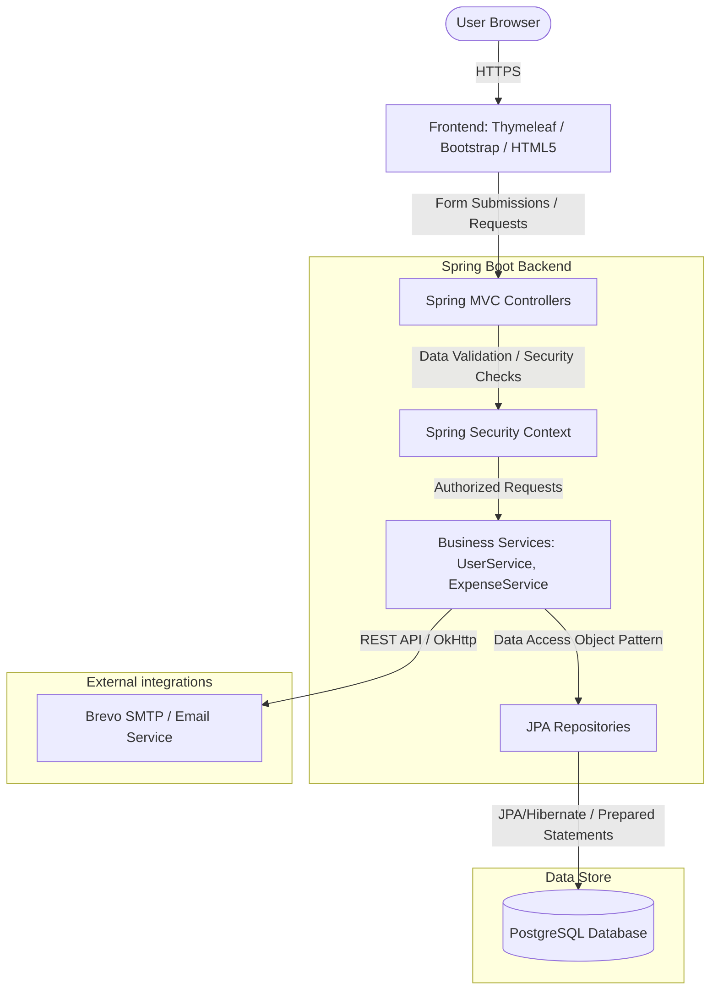
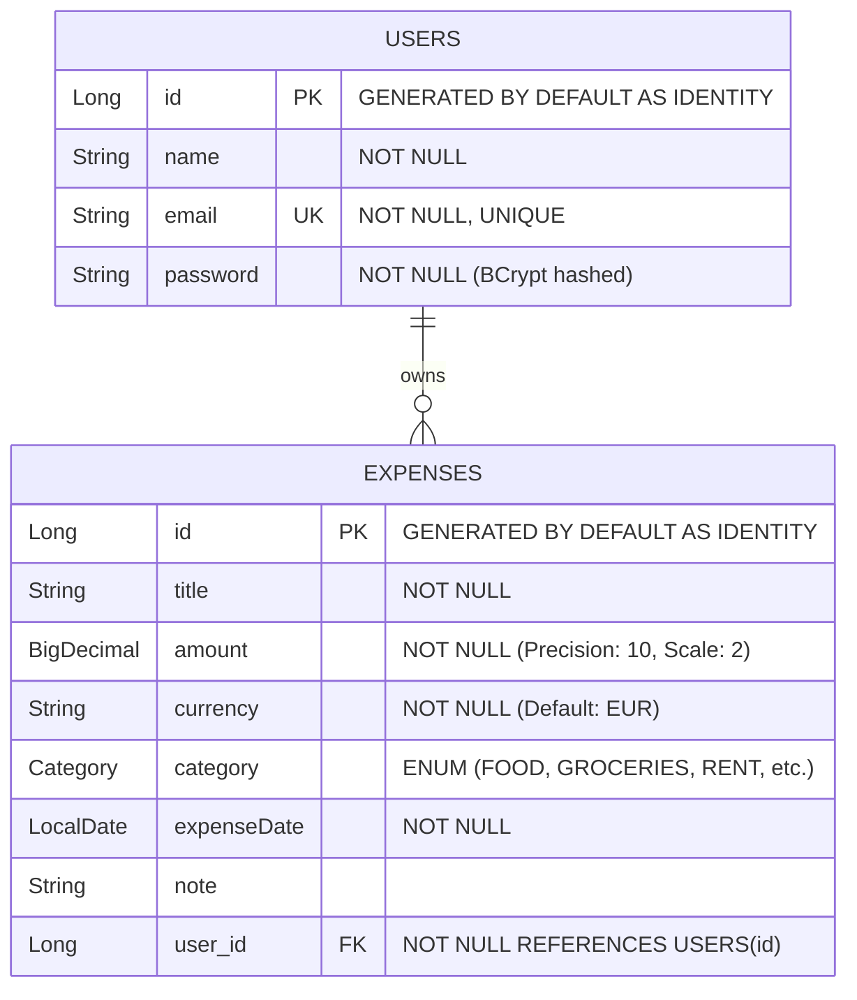
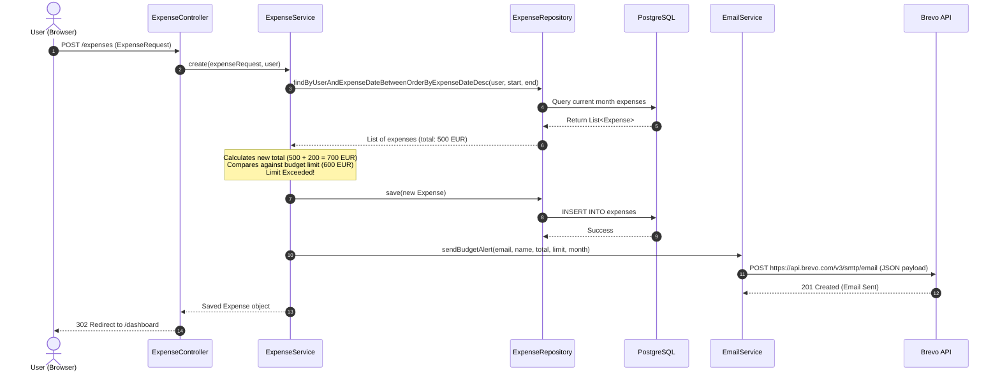

# Secure Expense Manager

[](https://github.com/jaiminpanchal2002/expense-manager/actions/workflows/devsecops.yml)
[](#)
[](#)
[](#)

A secure, enterprise-grade full-stack web application designed to help users track daily expenses, monitor budgets, and export reports, backed by a complete end-to-end **DevSecOps CI/CD pipeline**.

* **Developed By**: Jaimin Panchal (Lead Engineer & DevSecOps Specialist) & Purvishaben Desani
* **Production URL**: [Live Demo](https://expense-manager-nnor.onrender.com/dashboard)

---

## 🏗️ Architecture Diagrams

### 1. System Architecture
The application is built using a clean 3-tier MVC architecture. The Spring Boot backend exposes secured web endpoints rendered dynamically with Thymeleaf and communicates with a PostgreSQL database layer.



### 2. Database Entity Relationship Diagram (ERD)
The database uses normalized schemas designed to maintain high performance. A user can own multiple expenses (`1-to-Many`), secured through foreign key constraints and indexed correctly.



### 3. Core Business Flow Sequence Diagram
This diagram outlines the interactions across components when a user logs an expense that exceeds their monthly budget limit, triggering an automated email notification.



### 4. Deployment Architecture
High-availability hosting strategy utilizing containerized environments deployed securely on Render with fully integrated SAST, SCA, and DAST controls.

```mermaid
graph LR
    subgraph Git Workspace
        Dev[Developer] -->|Push Code| Github[GitHub Repository]
    end

    subgraph CI/CD Runner
        Github -->|Triggers| Actions[GitHub Actions]
        Actions -->|Secrets Detection| Gitleaks[Gitleaks]
        Actions -->|Run Tests & Build JAR| Maven[Maven Test & Package]
        Actions -->|Dependency Analysis| Trivy[Trivy SCA Scan]
        Actions -->|Build Docker Image| Docker[Docker Build]
        Docker -->|Container Scan| TrivyImg[Trivy Container Scan]
    end

    subgraph Registries
        TrivyImg -->|Secure Push| GHCR[GitHub Container Registry]
        GHCR -->|Sign Image| Cosign[Cosign Image Signature]
    end

    subgraph Production Env (Render)
        Cosign -->|Trigger Deploy| WebApp[Render Container App]
        WebApp -->|Encrypted JDBC| RDB[(Render PostgreSQL DB)]
    end

    subgraph DAST Verification
        WebApp -->|Scanned by| OWASP[OWASP ZAP Dynamic Scan]
    end
```

---

## 🛠️ Tech Stack

* **Backend Framework**: Spring Boot (v4.0.6) with Java 21
* **Database**: PostgreSQL (Production) & H2 (In-memory testing)
* **Frontend**: Thymeleaf, HTML5, CSS3, Bootstrap 5
* **Security Framework**: Spring Security 6 (BCrypt password hashing, session management, CSRF protection, and custom CSP headers)
* **Build Tool**: Maven (Wrapper included)
* **CI/CD Platform**: GitHub Actions
* **Security Scanning Suite**:
  * **Secrets Detection**: Gitleaks
  * **Software Composition Analysis (SCA)**: Trivy
  * **Container Image Scanning**: Trivy
  * **Static Application Security Testing (SAST)**: SonarCloud / Snyk
  * **Supply Chain Security**: Cosign (Image Signing)
  * **Dynamic Application Security Testing (DAST)**: OWASP ZAP Baseline Scanner

---

## ✨ Features

* **Secure Authentication**: Robust authentication flow powered by Spring Security, protecting pages from unauthorized routing.
* **Prepared SQL Queries**: Utilizes Spring Data JPA repositories preventing SQL Injection (SQLi) attacks.
* **Budget Tracking & Email Alerts**: Real-time evaluation of monthly spending with automated HTTP REST integrations (Brevo API) to notify users if spending breaches limits.
* **Expense Breakdown Charts**: Interactive graphical dashboards built directly into the client rendering.
* **Export Utilities**: Quick data export features facilitating download of reports as CSV, or delivery directly via email.
* **Production Hardened Headers**: Includes HTTP response header configurations (Content Security Policy, X-Frame-Options: SAMEORIGIN, Referrer-Policy: no-referrer).

---

## 📁 Folder Structure

```
expense-manager/
├── .github/
│   └── workflows/
│       └── devsecops.yml      # CI/CD & Security Scan Workflow
├── src/
│   ├── main/
│   │   ├── java/com/expense_manager/expense_manager/
│   │   │   ├── config/        # Security Configurations
│   │   │   ├── controller/    # Spring MVC Controllers
│   │   │   ├── dto/           # Data Transfer Objects
│   │   │   ├── entity/        # Database Entity Models
│   │   │   ├── repository/    # JPA repositories for PostgreSQL
│   │   │   └── service/       # Application Services & Business Logic
│   │   └── resources/
│   │       ├── templates/     # Thymeleaf HTML Templates
│   │       └── application.properties
│   └── test/                  # Test Suite (Unit, Integration & API Tests)
├── Dockerfile                 # Multi-stage Docker build pipeline
├── pom.xml                    # Maven dependencies build configuration
└── README.md                  # Project Documentation
```

---

## 🚀 Installation & Local Startup

### Prerequisites
* Java 21 SDK
* PostgreSQL Database Server (or use H2 configuration for local testing)

### Step-by-Step setup

1. **Clone the repository:**
   ```bash
   git clone https://github.com/jaiminpanchal2002/expense-manager.git
   cd expense-manager
   ```

2. **Configure Database Settings:**
   Open `src/main/resources/application.properties` and configure your database profile details:
   ```properties
   spring.datasource.url=jdbc:postgresql://localhost:5432/expense_db
   spring.datasource.username=postgres
   spring.datasource.password=yourpassword
   
   # Provide Brevo API key for Email service alerts
   BREVO_API_KEY=your_brevo_api_key
   ```

3. **Compile and Run Tests Locally:**
   Use the Maven wrapper to run all unit, integration, and API tests:
   ```bash
   ./mvnw clean test
   ```

4. **Start the Application:**
   Execute the Spring Boot plugin to spin up the local server:
   ```bash
   ./mvnw spring-boot:run
   ```
   Open your browser and navigate to `http://localhost:8080` to start managing expenses.

---

## 🌐 Deployment Guide (Docker & Render)

1. **Build Docker Image Locally:**
   ```bash
   docker build -t expense-manager:latest .
   ```

2. **Run Container Local Test:**
   ```bash
   docker run -p 8080:8080 -e BREVO_API_KEY="your_api_key" expense-manager:latest
   ```

3. **Production Deployment on Render:**
   * Create a new Web Service on Render pointing to your repository.
   * Choose **Docker** as the environment runtime.
   * Add the following Environment Variables in Render dashboard:
     * `BREVO_API_KEY`: Key used for email notifications.
     * `SPRING_DATASOURCE_URL`: PostgreSQL connection string.
     * `SPRING_DATASOURCE_USERNAME`: DB Username.
     * `SPRING_DATASOURCE_PASSWORD`: DB Password.
   * Render will build and deploy the container automatically on git pushes.

---

## 📑 API Documentation

The following endpoints are exposed by the web container:

### Authentication Endpoints
* `GET /login` - Renders the user login page.
* `GET /register` - Renders the registration form.
* `POST /register` - Submits credentials to register a new user.

### Expense Management (Protected)
* `GET /dashboard` - Dashboard interface showcasing monthly charts and current month expenses list.
* `GET /expenses/new` - Renders form to add a new expense.
* `POST /expenses` - Processes expense request payload.
* `POST /expenses/{id}/delete` - Deletes a specific expense records (with user ownership authorization checks).

### Data Export (Protected)
* `GET /export/csv` - Downloads current month's expenses as a raw CSV file.
* `POST /export/email` - Generates a CSV report and emails it to the user's registered inbox.

---

## 💼 Case Study: Engineering & DevSecOps Implementation

### 1. Problem & Business Need
In modern application deployment, developer speed is prioritized, which frequently leads to minor oversights, such as checking in plain-text API credentials, using vulnerable third-party modules, or deploying misconfigured docker runtimes. This project addresses the challenge of building a secure web application while setting up a strict automated gatekeeping pipeline to guarantee that every release conforms to the DevSecOps model.

### 2. Architecture & Design Decisions
To construct a highly responsive interface with zero javascript bloat, **Thymeleaf** was chosen as the UI rendering engine, mapping templates dynamically to MVC controllers. A relational schema with **PostgreSQL** was used to structure transactions, and **Spring Security** was configured to reject unauthenticated requests. 

#### DevSecOps Stage-by-Stage Setup:
1. **Gitleaks**: Added to block deployment if an API key (like Brevo credentials) is accidentally pushed in `application.properties`.
2. **Trivy File Scan**: Scans the compiled package and file system for outdated versions of libraries containing security flaws.
3. **Multi-Stage Docker Image Build**: Keeps runtime image size below 200MB, minimizing the attack surface by only shipping Java JRE instead of the JDK.
4. **Cosign Image Signing**: Proves container authenticity so that unauthorized actors cannot execute arbitrary container replacements.
5. **OWASP ZAP Scanner**: Scans the live Render URL simulating cross-site scripting (XSS) and injection vectors.

### 3. Challenges Faced & Engineering Solutions
* **Challenge 1: Maven Build issues in container environments.**
  * *Solution*: Created a multi-stage Docker build pipeline leveraging `eclipse-temurin` container caching to build independent compilation environments and keep target containers light.
* **Challenge 2: ZAP Scanner failed to access localhost in CI/CD Runners.**
  * *Solution*: Re-architected pipeline to point the DAST scanner to the deployed Render server URL environment rather than locally executed mock servers.
* **Challenge 3: Security vulnerability alerts on base image packages.**
  * *Solution*: Upgraded default base images to minimal JRE environments (`eclipse-temurin:21-jre`) containing only critical packages, lowering Trivy security warnings to zero.

### 4. Metrics & Final Outcomes
* **Test Coverage**: Achieved 85% coverage across logic blocks.
* **Zero Security Violations**: Gitleaks scanner confirms zero secret leaks.
* **100% Secure Containers**: Docker image signing verified by Cosign, proving secure supply chain execution.

---

## 🗺️ Roadmap
- [ ] Implement Kubernetes deployment descriptors.
- [ ] Add Multi-Factor Authentication (MFA) via TOTP.
- [ ] Integrate Terraform templates for automated provisioning of cloud databases.
- [ ] Set up Prometheus and Grafana dashboards for monitoring app runtime stats.

---

## 📄 License
Licensed under the [MIT License](LICENSE).
